# Setting Up VS Code + GitHub Copilot Pro

This guide walks you through getting **GitHub Copilot Pro running inside Visual Studio Code**, and using R with it. Copilot Pro normally costs money, but as a Columbia student you get it **free** through GitHub Education.

The goal is to have: VS Code installed, Copilot Pro activated, and a working R + Copilot setup that suggests, explains and writes code based on your needs. For the purpose of this class, you can think of GitHub Copilot as an AI-powered coding assistant.

---

## Step 1 — Get a GitHub Account

- Create a **GitHub account** for free at [github.com](https://github.com) if you don't have one.
- When creating the account, it's best to use a **personal email** rather than your Columbia one, so you keep access to the account after you graduate. You'll add your Columbia email later to unlock GitHub Education.

---

## Step 2 — Get free Copilot Pro through GitHub Education

GitHub gives verified students the **Student Developer Pack**, which includes Copilot Pro at no cost.

1. Go to **[github.com/education/students](https://github.com/education/students)** and click **Join GitHub Education** (or scroll down to **Get verified**).

2. If needed, sign in with your GitHub account.
3. When prompted, apply for GitHub Education with your **Columbia `@columbia.edu` email** and verify your student status. You may be asked to:
   - confirm your school email, and/or
   - upload **proof of enrollment** (e.g., a photo of your student ID or a dated enrollment document).
4. Submit and wait for approval. This can take anywhere from a **few minutes to a few days, so apply ASAP.** Check your email (including spam) for the confirmation.
5. Once approved, confirm Copilot is active at **[github.com/settings/copilot](https://github.com/settings/copilot)** — you should see GitHub Copilot Pro listed as active as shown below:
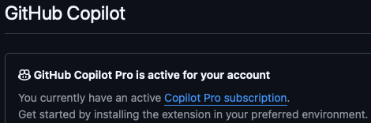

> **Note:** You must be approved for GitHub Education *before* Copilot will work in VS Code.

---

## Step 3 — Install Visual Studio Code

Download and install VS Code from **[code.visualstudio.com/download](https://code.visualstudio.com/download)**.

- **Mac:** download the `.zip`, unzip, and drag **Visual Studio Code** into your Applications folder.
- **Windows:** download and run the installer (`.exe`), accepting the defaults.

> **Note:** This guide is for **Visual Studio Code** (a free, lightweight editor) — NOT the larger "Visual Studio" IDE. Make sure you download Visual Studio Code (VS Code).

---

## Step 4 — Activate Copilot in VS Code

Recent versions of VS Code come with **GitHub Copilot built in** — you no longer need to install it as an extension. You just sign in to turn it on:

1. Click on the **Copilot icon**  in the VS Code Status Bar (or click the **Accounts** icon at the bottom left and choose **Sign in**).
2. Choose a sign-in method to your GitHub account and follow the prompts — in the browser window that opens, **authorize** VS Code to use your GitHub account.
3. Return to VS Code. Because your account already has Copilot Pro (from Step 2), Copilot activates automatically. The Status Bar icon should now show it's **active** (no warning/slash through it).

> **Note:** Sign in with the **same GitHub account** you verified in Step 2. If you sign in with a different account, you'll be put on the limited free tier instead of your student Copilot Pro.

---

## Step 5 — Install extensions for R (and LaTeX)

Copilot is already built into VS Code, but you still need an extension to **run R** within VS Code. Open the **Extensions** panel by clicking the Extensions button on the left vertical panel  or by pressing the shortcut:
- **Mac:** `Cmd+Shift+X`
- **Windows:** `Ctrl+Shift+X`

Search for and install each of these (click **Install**):

| Extension | Why you need it |
|-----------|-----------------|
| **R** (by REditorSupport) | Run and edit R code — our main course language |
| **LaTeX Workshop** *(optional)* | Write your paper in LaTeX inside VS Code |


> **Tips:** 
> - The AI models that Copilot uses are strongest with **R and Python** since these are open-source and more examples using the code is public. This means it will struggle more with **Stata** FYI.
> - VS Code has lots of shortcuts using keyboard combinations. They will become second-nature the more you use it.

---

## Step 6 — Make R work with Copilot

To actually run R code within VS Code, you need R itself plus a couple of helpers:

1. **Install R** from [cran.r-project.org](https://cran.r-project.org) (and [RTools](https://cran.r-project.org/bin/windows/Rtools/) on Windows, if prompted). Some of you may have taken "ECON UN3412: Introduction to Econometrics" using R, so you may already have R (and RStudio) installed.
2. Open R (or the R console inside VS Code) and install the language server so the R extension can talk to Copilot:
   ```r
   install.packages("languageserver")
   ```
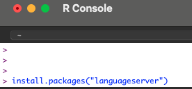

3. *(Recommended)* For nicer plots and a better console:
   ```r
   install.packages("httpgd") # in-editor plot viewer
   ```
4. If the R extension can't find R, set the path in VS Code. Go to **Settings** by first clicking the gear icon in the bottom left or press **Mac:** `Cmd + ,`/**Windows:** `Ctrl + ,`. Search for "Rpath" and enter the path to your R installation in the box for your operating system. On Mac, fill it in under this section:

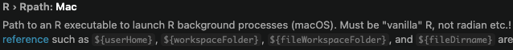

---

## Step 7 — Take it for a test run

1. Create a new R file in VS Code and save it as `test.R`.
2. Type a comment in the R file describing what you want. As an example:
   ```r
   # read a csv file and print summary statistics for each column
   ```
3. Press **Enter** and wait a moment — Copilot should offer **gray "ghost text"** suggesting code.
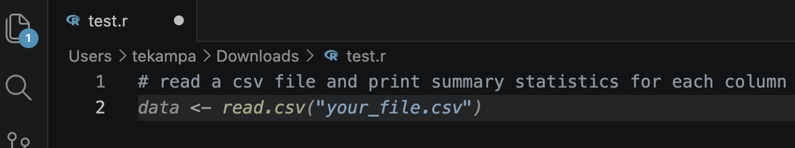
If you see a suggestion appear, **you're all set!** 🎉

   You can press **`Tab`** to accept it or **`Esc`** to decline it.
   > **Note:** in this example, Copilot (more specifically, the AI model) does not have a lot of context so the suggestion is very generic. The more context you give Copilot (more on this later and in other guides), the better suggestions it will provide.

4. Try **Chat** to ask Copilot about the code. You can click on the Chat icon  on the top middle bar and select "Open Chat" in VS Code or use the keyboard shortcut:
   - **Mac:** `Shift+Cmd+I`
   - **Windows:** `Shift+Ctrl+I`

   In the Chat window, you can now use Copilot for more specific things. It's good practice to give Copilot context before asking anything. When you have a file open and then open the Chat, you can click on the `+` icon next to your filename in the chat to add it to the Copilot context. At other times, you can remove a file from the context by clicking the `x` icon next to its filename.

   Ask in the Copilot Chat, what the code does. For example:

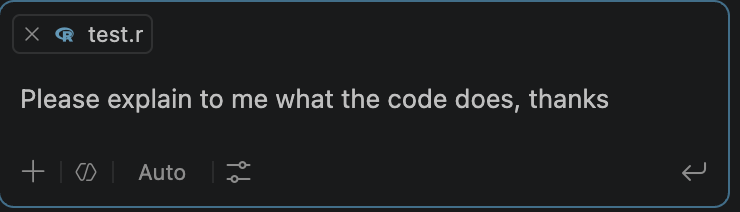

   Copilot will (usually) give you a useful explanation as shown below. Remember that due to different settings and contexts, AI model chosen, even time of day, etc. the output will not be exactly the same every time.

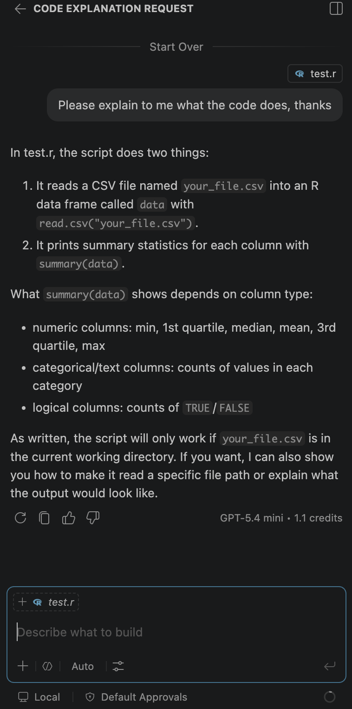

   You can ask Copilot Chat to edit your code directly too. For example,

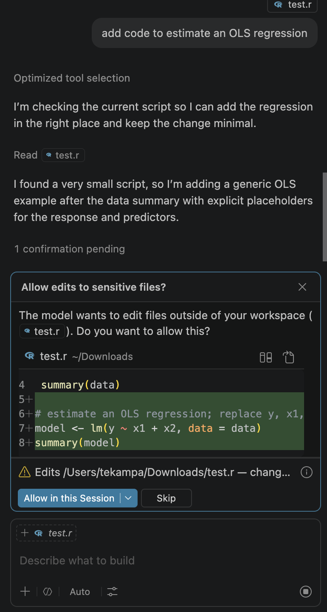

   Once you allow the change, Copilot will make it to the code file and you can Keep or Undo as needed.

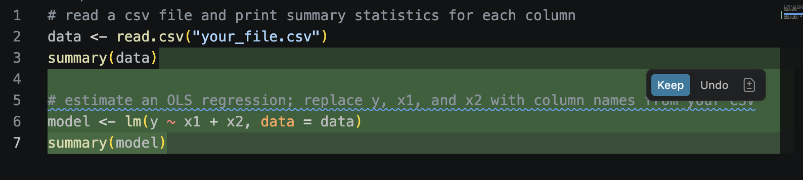

   > **Note:** when we're first learning to use these AI tools, I believe it's best to have Copilot ask you before making edits to files. When Copilot asks you for permission to make changes, I recommend choosing "Allow Once" initially. Once you feel comfortable with the task and AI output, you can ramp up the automatic approval settings.

## Step 8 — Running R in VS Code

If you used R with RStudio in your ECON UN3412 class, you may feel more comfortable running code with RStudio. As seen [here](https://www.tilburgsciencehub.com/topics/automation/ai/gpt-models/github-copilot/#rstudio), you could set up Copilot to run in RStudio. Though this will limit the ways AI can assist you when coding. It's smoother to run R code within VS Code so you don't have to switch back and forth between applications, and so you make better use of AI's capabilities.

Here's how to run R code in VS Code once the R extension (Step 5) and R itself (Step 6) are set up:

1. **Open your file and start an R terminal.** Open the Command Palette (**Mac:** `Cmd+Shift+P` / **Windows:** `Ctrl+Shift+P`), type **`R: Create R terminal`**, and press **Enter**. An R console opens in the panel at the bottom of VS Code. (If you skip this, one is created automatically the first time you run code.)

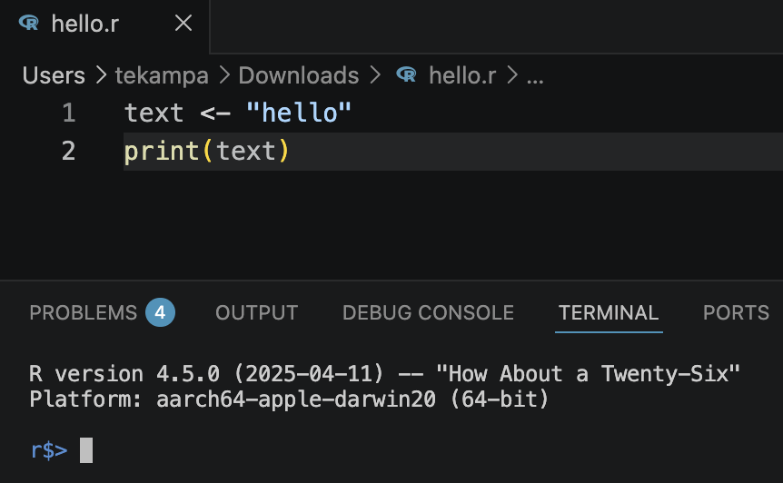

2. **Run a single line or a selection.** Put your cursor on a line (or highlight several lines) and press:
   - **Mac:** `Cmd+Enter`
   - **Windows:** `Ctrl+Enter`

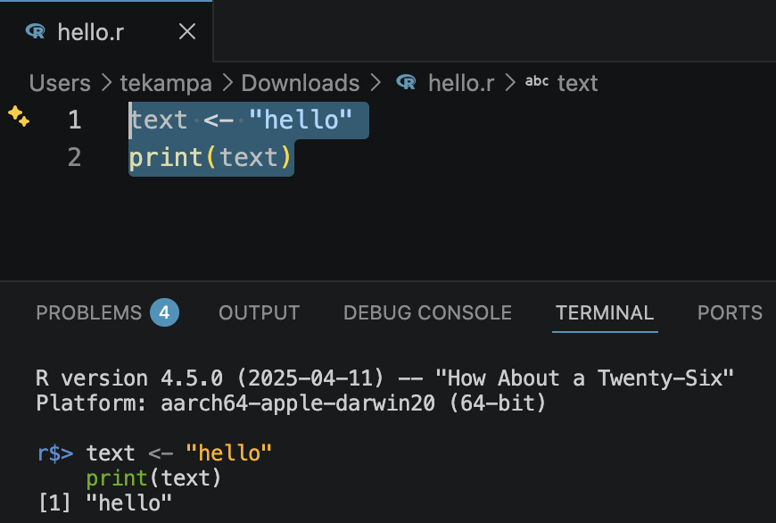

   The code is sent to the R terminal and, if nothing was selected, your cursor moves to the next line — just like running code chunk-by-chunk in RStudio.

3. **Run the whole file.** To execute the entire script from top to bottom, you can either:
   - Click the **▷ Run Source** button in the top-right corner of the editor (hover over it to see its keyboard shortcut — on my Mac it's `Shift+Cmd+S`), or
   - Open the Command Palette (`Cmd+Shift+P` / `Ctrl+Shift+P`) and select **`R: Run Source`**.

4. **VS Code set-up similar to RStudio.** Once you've installed the R Extension in VS Code, you should observe the R icon in the left panel of VS Code: .
Clicking it opens an R view that should feel similar to RStudio, listing what's in your workspace along with R help options.

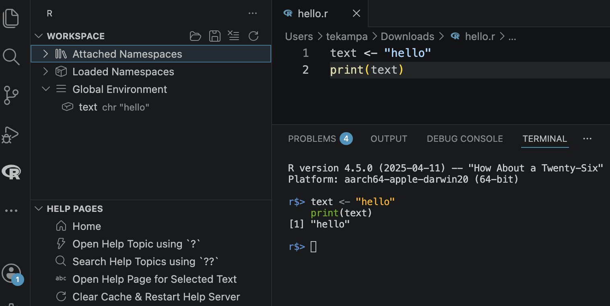

5. **See your plots.** If you installed `httpgd` in Step 6, plots open in a dedicated viewer panel inside VS Code. To make it the default, open **Settings** (`Cmd+,` / `Ctrl+,`), search for **`r.plot.useHttpgd`**, and turn it on.

> **Tip:** Type R directly into the R terminal for quick, one-off commands (like `head(mydata)`), but keep the reusable parts of your analysis in the `.R` file so you can easily re-run and share them.

---

## Handy shortcuts

| Action | Mac | Windows |
|--------|-----|---------|
| Run R line / selection | `Cmd+Enter` | `Ctrl+Enter` |
| Accept suggestion | `Tab` | `Tab` |
| Dismiss suggestion | `Esc` | `Esc` |
| Open Copilot Chat panel | `Cmd+Ctrl+I` | `Ctrl+Alt+I` |
| Inline chat (ask about code) | `Cmd+I` | `Ctrl+I` |

---

## Troubleshooting

- **Copilot isn't suggesting anything as you type.** Check that (1) your GitHub Education application is **approved**, (2) you're **signed in** in VS Code, and (3) the status-bar Copilot icon shows active. Try **Developer: Reload Window** (Command Palette: `Cmd/Ctrl+Shift+P`).
- **Student pack still "pending."** Approval can take a few days. Make sure you used your `@columbia.edu` email and that your enrollment proof is legible.
- **R code won't run.** Confirm R is installed, the `languageserver` package is installed, and the R extension's path setting points to your R install.
- **Wrong editor.** Make sure you installed **Visual Studio Code**, not "Visual Studio."

---
## General Notes
- AI tools evolve constantly, including how you set them up. Let me know if any instructions here appear out of date.
- If you're working on a project that contains many files, it's better to open the parent folder in VS Code and then open the file you want to work with. This way VS Code and R use it as the working directory and Copilot can use all the files in the parent folder as context to give more helpful output when editing the file that is relevant to the project.

---
## Video Tutorials Online
Given the growth of using AI for coding, there are many online video tutorials to complement these instructions. Note that most online tutorials examples give more software development/computer science examples instead of economics ones but the VS Code and GitHub Copilot tools apply similarily:
- https://learn.github.com/courses/githubcopilot101essentialfeatures
- [How to use GitHub Copilot (the complete beginner's guide)](https://www.youtube.com/watch?v=SJqGYwRq0uc)
- [Get Started with GitHub Copilot in VS Code (2025)](
https://www.youtube.com/watch?v=vdBxfFVXnc0)
- https://learn.microsoft.com/en-us/shows/visual-studio-code/get-started-with-github-copilot-in-vs-code
- https://www.microsoft.com/en-us/thesource-developer/Category/52/github-copilot-in-visual-studio-code
---
## References

This guide draws on:

- [GitHub Copilot — Tilburg Science Hub](https://www.tilburgsciencehub.com/topics/automation/ai/gpt-models/github-copilot/)
- [Setting up GitHub Copilot and VSCode — Paul Goldsmith-Pinkham](https://paulgp.substack.com/p/setting-up-github-copilot-and-vscode)
- [Setting up GitHub Student and GitHub Copilot — Microsoft Tech Community](https://techcommunity.microsoft.com/blog/educatordeveloperblog/step-by-step-setting-up-github-student-and-github-copilot-as-an-authenticated-st/3736279)
- [Get started with Visual Studio Code](https://code.visualstudio.com/docs/getstarted/overview#_install-vs-code)

